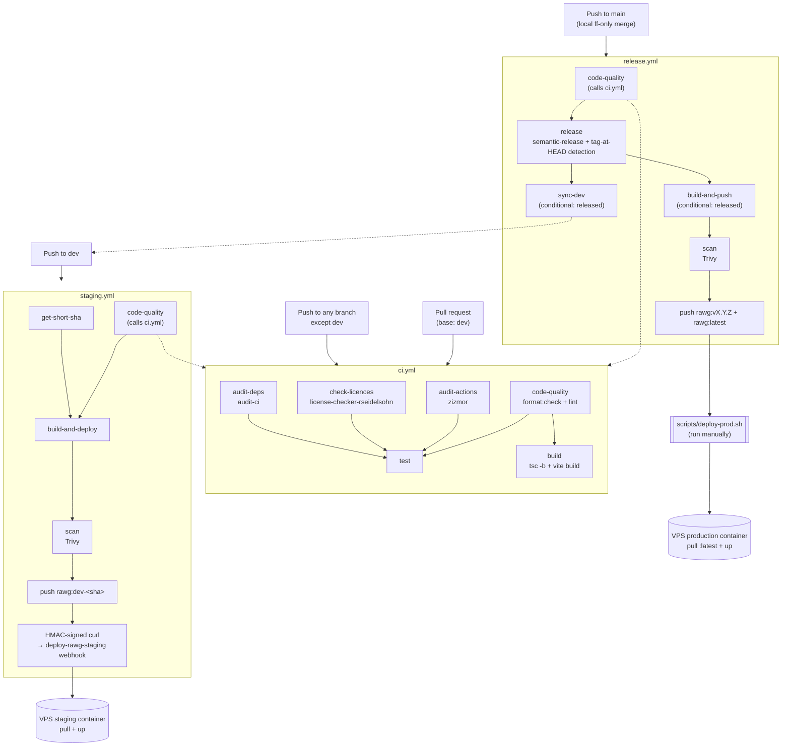

# RAWG

A React 19 + TypeScript single-page frontend, scaffolded with Vite and shadcn/ui, deployed as a static app behind nginx.

## Stack

| Tool                                          | Version | Purpose                      |
| --------------------------------------------- | ------- | ---------------------------- |
| [Vite](https://vite.dev)                      | 7       | Build tool & dev server      |
| [React](https://react.dev)                    | 19      | UI framework                 |
| [TypeScript](https://www.typescriptlang.org)  | 5.9     | Type safety                  |
| [Tailwind CSS](https://tailwindcss.com)       | 4       | Utility-first styling        |
| [shadcn/ui](https://ui.shadcn.com) / Radix UI | —       | Component library primitives |
| [Vitest](https://vitest.dev)                  | 4       | Unit testing                 |

**Tooling:** ESLint (strict TypeScript + React rules), Prettier (with Tailwind class sorting), pnpm.

## Prerequisites

- Node.js 24+ (CI runs 24; see `.github/actions/setup-environment/action.yml`)
- [pnpm](https://pnpm.io) — `npm install -g pnpm` (version pinned via `packageManager` in `package.json`)

## Getting Started

```bash
pnpm install
pnpm dev
```

No Docker required for local development — see [Docker](#docker-optional-local-dev-container) below for an optional containerized alternative.

## Contributing

- **Branches:** `dev` is staging, `main` is production (fast-forward only, no merge commits). Create short-lived branches off `dev` using `feat/`, `fix/`, `ci/`, `docs/`, `refactor/`, `perf/`, `test/`, `style/`, or `chore/` prefixes.
- **Workflow:** rebase your branch onto `dev`, open a PR, squash-merge. `dev` → `main` is promoted locally via `git merge --ff-only` — never through a GitHub PR merge.
- **Commits:** Must follow [Conventional Commits](https://www.conventionalcommits.org/) — run `pnpm commit` for an interactive wizard. Allowed types: `feat`, `fix`, `chore`, `ci`, `docs`, `style`, `refactor`, `perf`, `test`, `build`, `revert`. Git hooks (`commit-msg` and `pre-push`) enforce locally; `pre-push` re-validates to catch `--no-verify` bypasses.
- Details: [Branching Strategy](docs/github-branching-strategy.md) · [Linear History Workflow](docs/github-linear-history-workflow.md)

## CI/CD

### Workflows



### Checking audit findings locally

`audit-actions` statically analyzes your workflow files for misconfigurations like script injection or excessive permissions, and blocks `test` on violations — since `staging.yml` and `release.yml` both call `ci.yml`, this also blocks staging deploys and release builds, not just PR merges. Preview zizmor's findings before pushing (requires [`uv`](https://docs.astral.sh/uv/) and the [GitHub CLI](https://cli.github.com/), authenticated via `gh auth login`):

```bash
GH_TOKEN=$(gh auth token) uvx zizmor --config zizmor.yml .
```

Passing a token enables the same "online audit" checks CI runs with; without one, those checks are silently skipped and a local pass could still fail in CI.

`check-licences` validates dependencies against the license allowlist and blocks `test` on violations — since `staging.yml` and `release.yml` both call `ci.yml`, this also blocks staging deploys and release builds. Check locally with:

```bash
./scripts/check-licences.sh
```

See [`docs/check-licences.md`](docs/check-licences.md) for the full license policy, the current exceptions list, and how to add a new one.

`audit-deps` runs [`audit-ci`](https://github.com/IBM/audit-ci) against production dependencies and blocks `test` on high/critical severity vulnerabilities (CVSS ≥ 7.0) — since `staging.yml` and `release.yml` both call `ci.yml`, this also blocks staging deploys and release builds. Check locally with:

```bash
pnpm dlx audit-ci@7.1.0 --config .audit-ci.json
```

See [`docs/audit-deps.md`](docs/audit-deps.md) for the severity gate rationale, the allowlist workflow for known false positives, and how to fix a flagged vulnerability.

The `scan` step in `staging.yml`/`release.yml` runs [Trivy](https://github.com/aquasecurity/trivy) against the built Docker image and blocks the push to Docker Hub on high/critical severity vulnerabilities (CVSS ≥ 7.0). Check a locally-built image with:

```bash
docker build -t rawg:scan-test -f Dockerfile --target prod .
docker run --rm -v /var/run/docker.sock:/var/run/docker.sock aquasec/trivy image \
  --db-repository="ghcr.io/aquasecurity/trivy-db:2" \
  --severity HIGH,CRITICAL --scanners vuln rawg:scan-test
```

See [`docs/audit-docker-images.md`](docs/audit-docker-images.md) for the full allowlist and fix workflow.

### Dependabot

[`.github/dependabot.yml`](.github/dependabot.yml) configures weekly Dependabot scans across `npm`/pnpm, Docker, and GitHub Actions dependencies. `npm`/`docker` are scoped to security-only via `open-pull-requests-limit: 0` + a `security-updates` group (`groups.<name>.applies-to: security-updates` — there is no `security-updates-only` key, it doesn't exist in Dependabot's schema); `github-actions` keeps routine weekly bumps in addition to security grouping. See [`docs/audit-deps.md`](docs/audit-deps.md#dependabot) and [`docs/audit-github-actions.md`](docs/audit-github-actions.md#dependabot) for the full mechanism.

> ⚠️ **Outstanding manual step:** Dependabot alerts and Dependabot security updates must still be enabled by a human in **Settings → Code security**. Until that's done, `npm`/`docker` will open **zero** Dependabot PRs — routine updates are capped at `0` by this config, and security updates (the feature that would fill the gap) aren't switched on yet.

### Deploying to staging (automated)

Push to `dev`:

```bash
git push origin dev
```

`staging.yml` picks it up, runs the `ci.yml` checks, builds + scans + pushes `rawg:dev-<short-sha>` to Docker Hub, then sends an HMAC-signed request to the `deploy-rawg-staging` webhook — no manual step needed.

> ⚠️ **Outstanding manual step:** the `deploy-rawg-staging` hook, its HMAC secret (`WEBHOOK_SECRET_RAWG_STAGING`), and the `VPS_HOOKS_BASE_URL` repository variable need to be set up — see [`docs/semantic-release-install-guide.md`](docs/semantic-release-install-guide.md#manual-github-configuration-checklist).

### Deploying to production (manual)

1. Promote `dev` → `main` locally via `git merge --ff-only` and push — see [Linear History Workflow](docs/github-linear-history-workflow.md#2-dev--main-local-fast-forward-only) for the exact commands.

   The push to `main` triggers `release.yml`. Its `release` job runs semantic-release, which determines the next version from commits since the last tag and — if warranted — bumps `package.json`, updates `CHANGELOG.md`, tags, and creates a GitHub Release. No manual tag needed. If a release was published, `build-and-push` then pushes `rawg:vX.Y.Z` + `rawg:latest` to Docker Hub, and `sync-dev` rebases `dev` onto `main` — none of this deploys anything.

2. Trigger the actual deploy yourself, from `scripts/`:

   ```bash
   scripts/deploy-prod.sh rawg v1.2.3
   ```

   Requires `WEBHOOK_SECRET_RAWG_PROD` set in `scripts/.env` (gitignored — copy `scripts/.env.sample` and fill it in). The script HMAC-signs the request and pulls the new image on the VPS.

## Docker (optional local dev container)

`docker-compose.yml` runs the app in a container equivalent to `pnpm dev`, bind-mounting the project so code changes still hot-reload — useful if you want a containerized dev environment, but not required:

```bash
docker compose up --build
```

Serves the dev server at `http://localhost:5173`. The same root [`Dockerfile`](Dockerfile) is also used to build the production image (`prod` stage, nginx serving the compiled static assets) — see [`docs/audit-docker-images.md`](docs/audit-docker-images.md) for details on that image and its vulnerability scanning. See details about [VPS setup](https://github.com/ddZ6ii/vps-infra/blob/main/docs/vps-setup.md).
